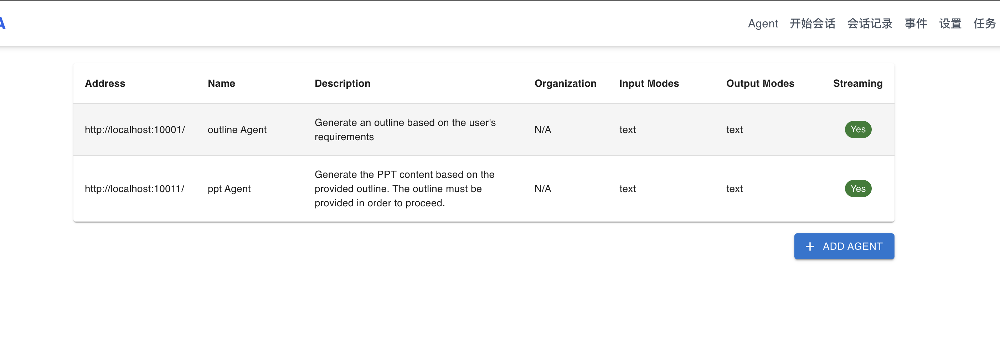
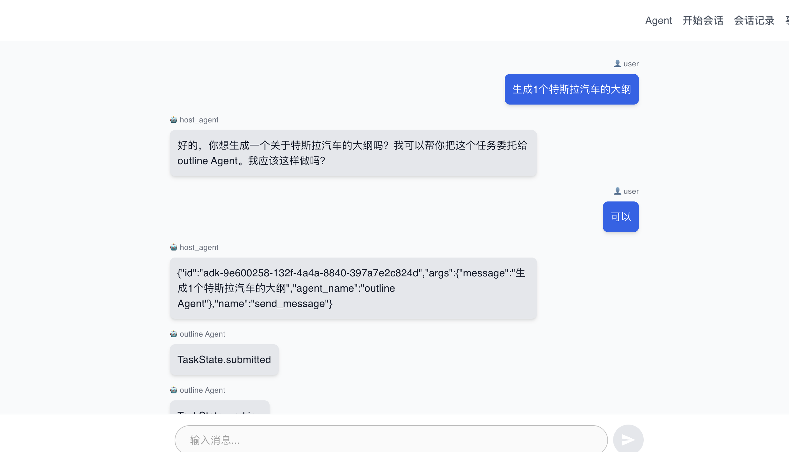
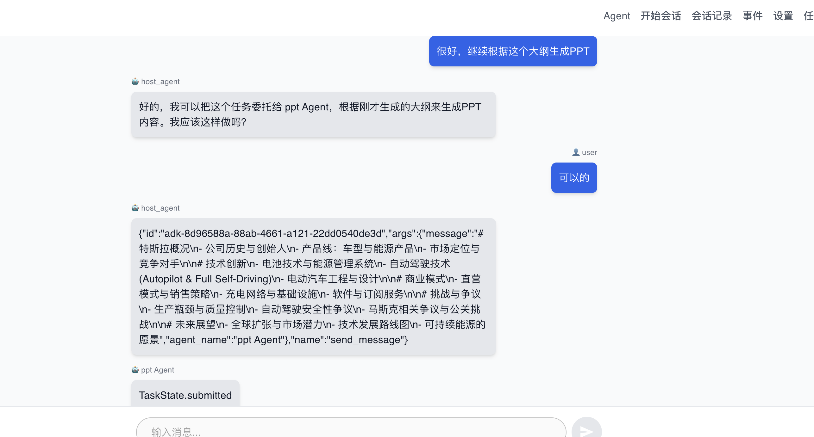
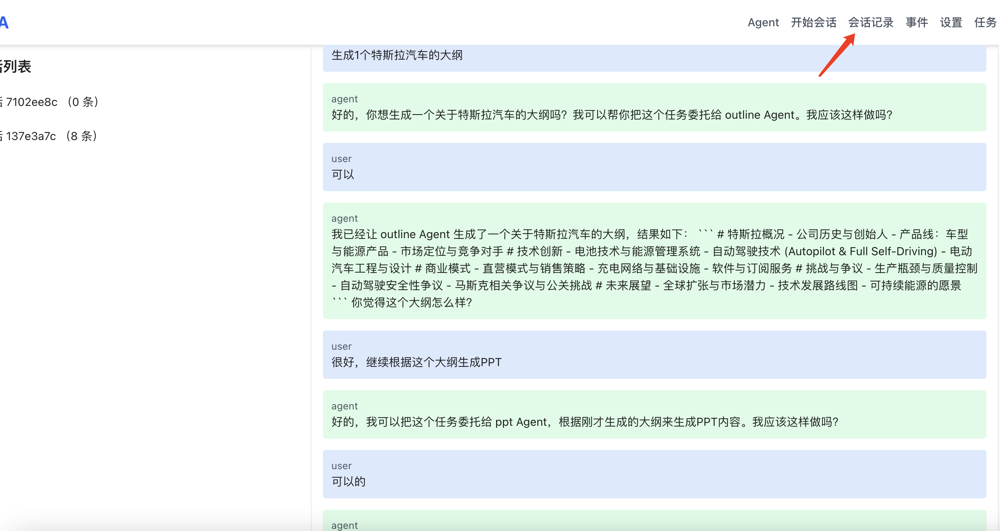

# 1.PPT相关的子Agent

## 后端的依赖
pip install -r requirements.txt

## 目录结构
simpleOutline   # 用于前端测试的大纲生成
simplePPT     # 用于前端测试的简单PPT生成
slide_outline   # 用于前端的大纲生成，经过检索生成大纲，更专业
slide_agent   #标准多智能体系统，根据大纲生成ppt，更专业
save_ppt      #保存成ppt文件，这里会使用python-pptx把通过ppt母版保存成pptx文件

## gemini目前最适配(第一次一定要用gemini试验，其它还有bug），其它的LLM的支持,可以修改create_model.py, 然后在你的.env文件中，对MODEL_PROVIDER和LLM_MODEL这2个环境变量进行配置
* 文件: slide_agent/slide_agent/create_model.py
* 文件: simpleOutline/create_model.py
* 文件: simplePPT/create_model.py
* 文件: hostAgentAPI/hosts/multiagent/create_model.py

## 开发中（待完善)
super_agent   # 文字版本的多智能体系统，用于串联多个Agent，纯文本的输入，输出，控制大纲和PPT生成

## 多Agent开发时注意事项：
每个子Agent的描述必须清晰，因为Super Agent根据每个子Agent任务确定它的输入信息。

# 2.自行开发多Agent项目(下面是详细的介绍，和本PPT项目无关)
hostAgentAPI  # 纯A2A的API的版本的总Agent，用于串联多个Agent
multiagent_front # super Agent的前端代码
slide_outline # 结合MCP工具调用实现的子Agent客户端
simplePPT #adk实现的子agent客户端

# A2A、ADK 与 MCP：构建多 Agent 层级调用系统

本文基于 **MultiAgentPPT** 项目，深入探讨如何利用最新版 **A2A (Agent-to-Agent)** 框架，融合 **Google ADK** 和 **FastMCP**，构建一个高效的多 Agent 层级调用系统。通过 **multiagent\_front** 前端界面，用户能够便捷地注册子 Agent、发起任务并跟踪会话，而 **Host Agent** 则负责协调子 Agent 完成任务分发与执行。我们将以 **PPT 大纲和内容生成**为例，展示 A2A 的层级调用机制、ADK 的任务增强能力和 FastMCP 的流式输出支持，重点突出系统的架构设计与实现细节。

-----

## 一、A2A 多 Agent 层级调用架构

A2A 框架的核心在于通过 Host Agent 实现多 Agent 的层级调用与管理。Host Agent 作为中央协调者，负责子 Agent 的注册、任务分配、上下文管理和结果整合。结合 Google ADK 和 MCP，系统实现了以下关键功能：

  * **子 Agent 注册与管理**：Host Agent 通过 `/agent/register` 和 `/agent/list` 接口维护子 Agent 列表，每个子 Agent 的功能描述（例如：生成 PPT 大纲或内容）被明确定义，确保任务精准分配。
  * **层级任务分配**：Host Agent 解析用户请求，动态分配任务给合适的子 Agent（例如：`slide_outline` 或 `slide_agent`），支持串行或并行执行。
  * **上下文管理**：通过 `/conversation/create` 和 `/message/send` 接口，Host Agent 维护会话状态，确保任务连续性。
  * **流式响应与事件跟踪**：结合 FastMCP 的 SSE (Server-Sent Events) 支持，系统能够实时返回任务状态和结果，并通过 `/events/get` 和 `/events/query` 跟踪事件。
  * **ADK 集成**：Google ADK 增强了子 Agent 处理复杂任务的能力，例如通过 GenAI API 生成结构化内容。

### 项目中的层级调用流程

以 PPT 生成为例，其流程如下：

1.  用户通过 **multiagent\_front** 前端输入任务（例如：“调研电动汽车发展”）。
2.  Host Agent 创建会话，并分配任务给 `slide_outline` 子 Agent 生成大纲。
3.  用户确认大纲后，Host Agent 调用 `slide_agent` 子 Agent 生成 PPT 内容。
4.  子 Agent 通过 ADK 调用 GenAI API 处理任务，FastMCP 提供 SSE 流式返回结果。

-----

## 二、环境搭建

### 1\. 后端环境

按照 **HostAgentAPI** 的 README 进行配置：

  * **安装依赖**：
    确保 Python 3 已安装，运行：

    在终端中执行 `pip install -r requirements.txt`。

  * **配置模型**：
    复制 `env_template.txt` 为 `.env`，并配置模型 `provider`（例如 Google、OpenAI）。示例：

    在 `.env` 文件中配置 `MODEL_PROVIDER=google` 和 `GOOGLE_API_KEY=your_api_key_here`。
    参考 `hostAgentAPI/hosts/multiagent/create_model.py` 设置支持的模型。

  * **启动 Host Agent API**：
    运行：

    在终端中执行 `python host_agent_api.py`。
    API 默认运行在 `http://localhost:13000`。

### 2\. 前端环境

按照 **A2A 多 Agent 对话前端** 的 README 配置 **multiagent\_front**：

  * **安装依赖**：
    确保安装 Node.js 和 npm，运行：

    在 `multiagent_front` 目录下执行 `npm install`。

  * **配置环境变量**：
    检查 `.env` 文件，确认 `REACT_APP_HOSTAGENT_API` 指向 API 地址：

    在 `multiagent_front/.env` 文件中确认 `REACT_APP_HOSTAGENT_API=http://127.0.0.1:13000`。

  * **启动前端**：
    运行：

    在 `multiagent_front` 目录下执行 `npm run dev`。
    前端默认在 `http://localhost:5173` 运行。

### 3\. 运行子 Agent 生成大纲

进入 `slide_outline` 目录：

在终端中执行 `cd slide_outline`。

  * **MCP 配置**：
    检查 `mcp_config.json`：

    在终端中执行 `cat mcp_config.json`。
    在 `.env` 中添加 Google GenAI API 密钥：

    在 `slide_outline/.env` 文件中添加 `GOOGLE_GENAI_API_KEY=your_genai_api_key`。

  * **启动 SSE 模式的 MCP 服务**：

    在 `slide_outline` 目录下执行 `fastmcp run --transport sse mcpserver/rag_tool.py`。

  * **启动主服务**：

    在 `slide_outline` 目录下执行 `python main_api.py`。
    子 Agent 的监听地址为 `http://localhost:10001`。

### 4\. 运行第二个子 Agent 根据大纲生成内容

进入 `simplePPT` 目录：

在终端中执行 `cd simplePPT`。
复制环境变量文件：
在终端中执行 `cp env_template .env`。

  * **启动主服务**：

    在 `simplePPT` 目录下执行 `python main_api.py`。
    子 Agent 的监听地址为 `http://localhost:10011`。

-----

## 三、通过前端实现 A2A 层级调用

**multiagent\_front** 前端提供了直观的界面，简化了 Agent 注册、任务发起和结果跟踪。以下是操作流程：

### 1\. 注册子 Agent

1.  打开前端界面 (`http://localhost:5173`)。

2.  进入 **Agent 注册** 页面（通常在顶部或侧边栏）。

3.  添加子 Agent 地址：

      * `http://localhost:10001`
      * `http://localhost:10011`

4.  提交后，Host Agent 会通过 `/agent/register` 记录子 Agent，界面将显示注册成功。

5.  在 **Agent 列表** 页面（调用 `/agent/list`）确认子 Agent 列表。

### 2\. 发起任务

1.  在 **对话** 或 **新建会话** 页面，点击“创建会话”。

2.  输入任务，例如：“调研电动汽车发展”。

3.  前端会调用 `/conversation/create` 获取 `conversation_id`，然后通过 `/message/send` 发送请求。

### 3\. Host Agent 层级调用原理

  * **任务解析**：Host Agent 使用 `list_remote_agents` 工具查询可用子 Agent。

  * **任务分配**：根据请求内容，Host Agent 分配任务给 `slide_outline` 子 Agent 生成大纲。

  * **ADK 增强**：`slide_outline` 通过 `adk_agent_executor.py` 调用 Google GenAI API，生成结构化大纲。

  * **FastMCP 流式输出**：FastMCP 通过 SSE 实时返回大纲，状态更新（例如：“submitted” → “working” → “completed”）会显示在前端。

### 4\. 查看中间结果

前端会实时显示大纲。在 **会话列表** 页面查看所有会话（`/conversation/list`）。点击会话，可以查看消息历史（`/message/list`）和事件记录（`/events/query`），如任务状态更新或产物生成。

-----

## 四、A2A 结合 ADK 和 FastMCP 的技术亮点

### 1\. A2A 层级调用

  * **动态任务分配**：Host Agent 根据子 Agent 描述动态选择执行者，支持复杂任务分解。
  * **工具支持**：Host Agent 内置 `list_remote_agents` 和 `send_message` 工具，简化任务分发。
  * **事件驱动**：通过 `add_event` 记录用户消息、Agent 状态更新和产物生成，确保全流程可追溯。

### 2\. Google ADK 集成

  * **增强子 Agent 能力**：`adk_agent_executor.py` 集成 Google GenAI API，处理复杂任务如结构化内容生成。
  * **模块化设计**：ADK 逻辑与 A2A 分离，子 Agent 可独立扩展。

### 3\. A2A 的 SSE

  * **流式输出**：A2A 通过 SSE 实时推送任务状态和结果，提供更流畅的用户体验。

### 4\. 原理图
```mermaid
graph TD
    %% 定义节点
    A[用户] -->|发起任务| B(multiagent_front 前端)
    B -->|调用 API| C(Host Agent)
    
    %% Host Agent 与子 Agent 交互
    C -->|根据问题分配任务| F[slide_outline 子 Agent]
    C -->|根据问题分配任务| G[simplePPT 子 Agent]
    
    %% 子 Agent 与外部服务
    F -->|调用adk多agent| I[ADK多Agent流程]
    G -->|MCP协议| H[MCP工具]
    
    %% 前端显示
    B -->|显示数据流| A
    
    
    %% 样式定义
    classDef host fill:#f9f,stroke:#333,stroke-width:2px;
    classDef agent fill:#bbf,stroke:#333,stroke-width:2px;
    classDef frontend fill:#dfd,stroke:#333,stroke-width:2px;
    classDef external fill:#fbf,stroke:#333,stroke-width:2px;
    
    class C host;
    class F,G agent;
    class B frontend;
    class I,H external;
```

生产环境更复杂示例
```mermaid
flowchart TD
    A[用户请求] --> C[Host Agent<br/>控制子Agent]
    C --> D[Document Agent<br/>A2A Server]
    C --> P[PPT Agent<br/>A2A Server]
    C --> Q[Excel Agent<br/>A2A Server]
    D --> E[Writer Agent<br/>ADK结构 Sequential]
    E --> F[Translate<br/>翻译处理]
    F --> G[Outline Generate<br/>生成大纲]
    G --> H[(RAG Search DB<br/>知识库检索)]
    H --> G
    G --> I[Split Outline<br/>大纲拆分]
    I --> J[Parallel Agent<br/>并行处理]
    J --> K1[Research Agent 1]
    J --> K2[Research Agent 2]
    J --> K3[Research Agent n]
    K1 --> L[Summary Agent<br/>摘要整合]
    K2 --> L
    K3 --> L
    L --> M[Refine Agent<br/>内容精炼]
    M --> N[(Web Search<br/>网络搜索)]
    N --> M
    M --> O[Output<br/>最终输出]

    classDef userInput fill:#e1f5fe
    classDef messageQueue fill:#f3e5f5
    classDef controlAgent fill:#e8f5e8
    classDef documentAgent fill:#fff3e0
    classDef writerAgent fill:#fce4ec
    classDef processNode fill:#f1f8e9
    classDef parallelNode fill:#e3f2fd
    classDef researchNode fill:#fff8e1
    classDef summaryNode fill:#f9fbe7
    classDef refineNode fill:#ffebee
    classDef database fill:#e0f2f1
    classDef output fill:#e8eaf6

    class A userInput
    class B messageQueue
    class C controlAgent
    class D documentAgent
    class E writerAgent
    class F,G,I processNode
    class J parallelNode
    class K1,K2,K3 researchNode
    class L summaryNode
    class M refineNode
    class H,N database
    class O output
```

-----

## 五、测试与调试

### 1\. 单元测试 HostAgentAPI

运行 `test_api.py` 验证 API 接口：

在终端中执行 `python test_api.py`。

检查状态码、响应内容和耗时。

### 2\. 整体测试

使用 `host_agent_api_client.py` 模拟前端操作：

在终端中执行 `python host_agent_api_client.py`。

### 3\. 常见问题

  * **PyCharm 异常**：如遇 `AttributeError: 'NoneType' object has no attribute 'call_exception_handler'`，请尝试使用命令行运行 `python host_agent_api.py`。

-----

## 六、注意事项

  * **子 Agent 描述清晰**：注册时需明确功能（例如：“Generates structured PPT outlines”），以确保 Host Agent 正确分配任务。
  * **会话管理**：建议为每个任务创建独立的会话，并使用前端的会话列表跟踪任务进度。

-----

## 七、总结

通过 A2A 框架结合 Google ADK 和 FastMCP，**MultiAgentPPT** 项目展示了一个高效的多 Agent 层级调用系统。Host Agent 协调子 Agent（例如 `slide_outline` 和 `simplePPT`），实现了任务从输入到输出的自动化处理。**multiagent\_front** 前端提供了直观的交互界面，支持 Agent 注册、任务发起和结果跟踪，显著提升了系统的灵活性和用户体验。这个架构不仅适用于 PPT 生成，还可扩展到其他多 Agent 协作场景，展现了 A2A 框架的强大潜力。

-----
